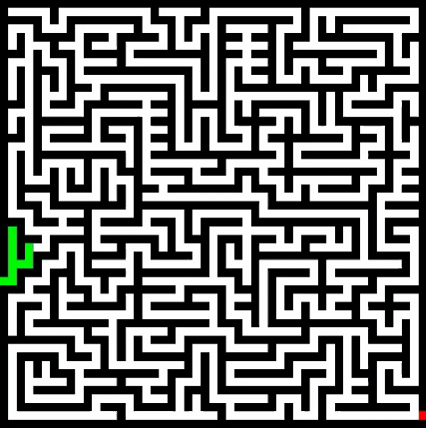

# Maze-Solver

Solves any images of mazes, as long as the starting point, ending point, walls and path have unique colors.



## Install dependencies

```sh
pip install pygame
```

## Running the solver
You can change the image in `prog.py`

```sh
python prog.py
```
